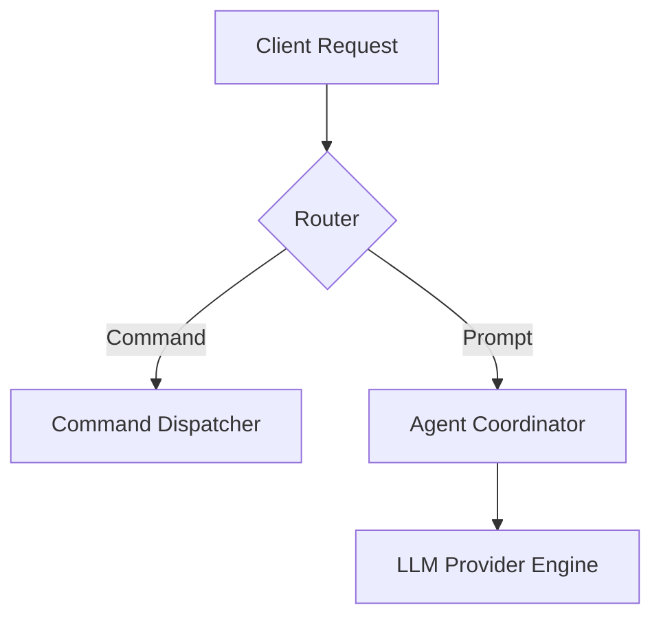

# Artifact Authoring Guide

An **artifact** is a persistent, structured document created to present detailed information (such as implementation plans, architecture designs, data tables, or migration walkthroughs) cleanly without cluttering the interactive conversation.

## When to Create an Artifact

### **Use Artifacts For:**
- **Step-by-step implementation plans**: Complex refactors, multi-stage features, migrations.
- **System architecture & data models**: Mermaid diagrams, database schemas, API specs.
- **Detailed reports & analysis**: Benchmarks, security audits, code reviews.
- **Visual progression & diff walkthroughs**: Carousels showing multi-state progressions.

### **Do NOT Use Artifacts For:**
- Simple one-off answers or quick command explanations.
- Short summaries that comfortably fit in a single conversational response.
- Asking clarifying questions or soliciting basic user input directly.

---

## File Organization & Location

- Store persistent artifacts in a designated directory (e.g. `.crush/artifacts/`, `docs/plans/`, or the session workspace).
- Use clear kebab-case basenames: e.g. `2026-migration-plan.md`, `architecture-diagram.md`.
- Reference artifacts in your chat response using standard clickable markdown links:
  `[migration-plan.md](file:///path/to/plan.md)`

---

## Formatting Guidelines

### 1. GitHub-Style Alert Callouts
Use callouts strategically to highlight key takeaways, constraints, or warnings:

```markdown
> [!NOTE]
> Background context, architecture invariants, or prerequisites.

> [!TIP]
> Optimization suggestions or recommended patterns.

> [!IMPORTANT]
> Essential steps, safety gates, or mandatory checklist items.

> [!WARNING]
> Breaking changes, deprecation notices, or backward compatibility risks.
```

### 2. Mermaid Diagrams
Use `mermaid` code blocks to visualize dataflows, state machines, and system relationships:

````markdown

````

### 3. Progressive Carousels
Use 4 backticks and `carousel` to display sequential slides, state comparisons, or alternative implementations:

````markdown
````carousel
```go
// Option A: Synchronous Execution
func Execute(ctx context.Context) error { ... }
```
<!-- slide -->
```go
// Option B: Worker Pool & Semaphore
func ExecutePool(ctx context.Context, workers int) error { ... }
```
````
````

---

## Feedback & Confirmation Workflow

When an artifact contains an actionable plan:
1. Provide a concise summary of key trade-offs in the chat response.
2. Link directly to the artifact document.
3. Highlight only the specific decisions or open questions requiring user confirmation before proceeding with implementation.
